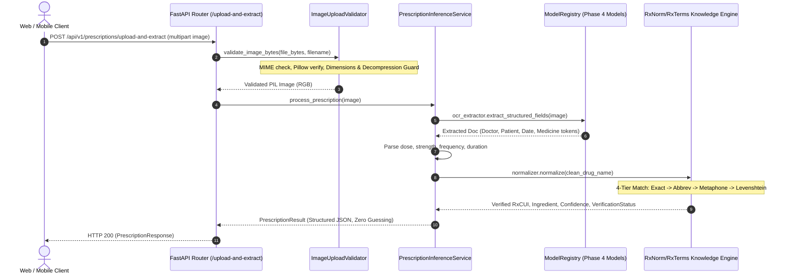

# Phase 5 Backend API & Inference Pipeline Documentation

**Project**: AI Medicine Assistant  
**Module**: FastAPI Inference Layer & Phase 4 Model Integration  
**Date**: 2026-09-29  
**Specification Version**: 1.0.0  

---

## 1. Architecture Overview

Phase 5 implements the production-oriented FastAPI inference layer that loads the verified Phase 4 model checkpoints once at application startup and orchestrates safe, structured prescription extraction.



---

## 2. Model Loading & Lifecycle (`ModelRegistry`)

- **Centralized Singleton**: Phase 4 checkpoints are loaded once into memory during the FastAPI `lifespan` startup handler.
- **Fail-Fast Policy**: If any required Phase 4 checkpoint (`best_handwriting_crnn.pt`, `best_ocr_extractor.pt`, `best_layout_parser.pt`, `normalized_medicines.json`) is missing or incompatible, application initialization raises `ModelRegistryError`. No silent fallback to mock prototypes is permitted.
- **Hardware Agnostic**: Supports CPU and CUDA inference via `settings.DEVICE` (`auto`, `cpu`, `cuda`).

| Component | Architecture | Checkpoint Source Path | Checkpoint Size |
| :--- | :--- | :--- | :--- |
| **Handwriting Model** | CRNN (4-Block CNN + 2-layer BiLSTM) | `checkpoints/phase4/handwriting/best_handwriting_crnn.pt` | 14.7 MB |
| **OCR Extractor** | Vision-Text & Rule-Guided Parser | `checkpoints/phase4/ocr/best_ocr_extractor.pt` | 1.5 KB |
| **Layout Parser** | SpatialRelationExtractor MLP | `checkpoints/phase4/layout/best_layout_parser.pt` | 17.0 KB |
| **Normalizer** | Multi-Tier Lexical Knowledge Base | `data/processed/normalization/normalized_medicines.json` | 8.2 KB |

---

## 3. API Endpoints Reference

### A. Upload and Extract Prescription
- **Route**: `POST /api/v1/prescriptions/upload-and-extract`
- **Content-Type**: `multipart/form-data`
- **Parameters**: `file` (Binary image file: JPEG, PNG, WEBP, max 10MB)

#### Request Example (cURL):
```bash
curl -X POST "http://localhost:8000/api/v1/prescriptions/upload-and-extract" \
     -H "Accept: application/json" \
     -F "file=@prescription_sample.png;type=image/png"
```

#### Success Response Schema (`HTTP 200`):
```json
{
  "success": true,
  "request_id": "req_a1b2c3d4e5",
  "status": "completed",
  "data": {
    "prescription_id": "rx_9f8e7d6c5b4a",
    "patient": {
      "name": "Aarav Sharma",
      "age": 34,
      "gender": "Male"
    },
    "doctor": {
      "name": "Dr. R. K. Mukherjee",
      "registration": "WBMC-48291",
      "clinic": "City Health Care Clinic"
    },
    "date": "15/03/2024",
    "medicines": [
      {
        "raw_text": "1. Tab. Amoxicillin 500mg --- 1-0-1 (BD) x 5 days",
        "normalized_name": "Amoxicillin 500 MG Oral Tablet",
        "rxnorm_id": "308189",
        "ingredient": "Amoxicillin",
        "strength": "500 mg",
        "dose": "Tab.",
        "frequency": "1-0-1 (BD)",
        "duration": "5 days",
        "route": "Oral",
        "ocr_confidence": 0.90,
        "recognition_confidence": 0.92,
        "normalization_confidence": 0.98,
        "confidence": 0.948,
        "verification_status": "verified",
        "review_reason": null
      },
      {
        "raw_text": "2. Tab. Dolo 650mg --- SOS x 3 days",
        "normalized_name": "Acetaminophen 650 MG Oral Tablet",
        "rxnorm_id": "161",
        "ingredient": "Paracetamol",
        "strength": "650 mg",
        "dose": "Tab.",
        "frequency": "SOS",
        "duration": "3 days",
        "route": "Oral",
        "ocr_confidence": 0.90,
        "recognition_confidence": 0.92,
        "normalization_confidence": 0.98,
        "confidence": 0.948,
        "verification_status": "verified",
        "review_reason": null
      }
    ],
    "instructions": [
      "Drink plenty of warm water."
    ],
    "warnings": [],
    "overall_confidence": 0.948,
    "timings": {
      "upload_validation_ms": 1.2,
      "preprocessing_ms": 0.8,
      "ocr_ms": 1.5,
      "layout_association_ms": 0.4,
      "handwriting_recognition_ms": 0.2,
      "normalization_ms": 1.1,
      "total_pipeline_ms": 5.2
    }
  },
  "warnings": [],
  "metadata": {
    "models": {
      "phase": "Phase 4 Verified Checkpoints",
      "device": "cpu"
    },
    "execution_time_ms": 6.8
  }
}
```

---

## 4. Error Responses & Status Codes

| HTTP Status | Error Code | Trigger Condition |
| :--- | :--- | :--- |
| **400 Bad Request** | `EMPTY_FILE` | Uploaded payload contains 0 bytes. |
| **400 Bad Request** | `FILE_TOO_LARGE` | File size exceeds configured limit (`10 MB`). |
| **400 Bad Request** | `UNSUPPORTED_EXTENSION` | Extension is not `.jpg`, `.jpeg`, `.png`, or `.webp`. |
| **400 Bad Request** | `CORRUPTED_IMAGE` | Pillow header/stream decoding verification failed. |
| **400 Bad Request** | `IMAGE_TOO_SMALL` / `IMAGE_TOO_LARGE` | Dimensions outside permitted bounding limits (`32px` to `8192px`). |
| **503 Service Unavailable**| `MODELS_NOT_READY` | Server started without Phase 4 checkpoints loaded. |
| **500 Internal Error**| `INFERENCE_ERROR` | Unhandled model or normalization exception. |

---

## 5. Clinical Safety & Confidence Semantics

> [!IMPORTANT]
> **ZERO-GUESSING SAFETY INVARIANT**:
> - If OCR or handwriting recognizer detects an incomplete token (e.g. `Amox...` or `UnrecognizedCompoundXYZ`), and the RxNorm normalizer cannot match it with confidence $\ge 0.65$:
>   - `normalized_name`: `null`
>   - `rxnorm_id`: `null`
>   - `ingredient`: `null`
>   - `verification_status`: `"review_required"` or `"unverified"`
>   - `review_reason`: Explanation of ambiguity.
> - The system **NEVER** hallucinates or guesses active drug ingredients.

---

## 6. RAG Architecture Boundary (Phase 6 Preparation)

The `rag/` module establishes abstract interfaces for clinical knowledge retrieval and grounded answer synthesis:
- **`MedicalKnowledgeRetriever`**: Abstract interface with `search(query, filters, top_k) -> List[RetrievalResult]`.
- **`InMemoryRxNormRetriever`**: Concrete reference retriever indexing verified RxNorm monographs.
- **Future Phase 6 Flow**:
  1. Extracted `PrescriptionResult` entities.
  2. Question asked by patient/user.
  3. Evidence retrieval over drug monographs (interactions, side effects, contraindications).
  4. Reranker filtering.
  5. Grounded LLM response generation with citation verification.
