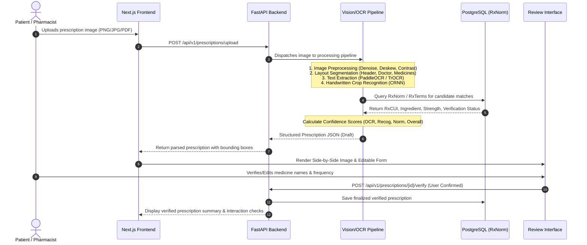
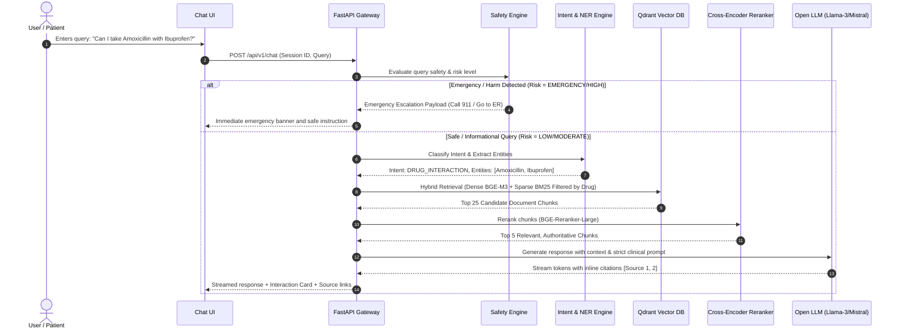

# AI Medicine Assistant: System Architecture & Design Specification

## 1. Executive Summary & Vision

The **AI Medicine Assistant** is an enterprise-grade, open-source medical informatics platform combining state-of-the-art Document AI, Computer Vision, Natural Language Processing, Deterministic Knowledge Graphs (RxNorm/RxTerms), and Retrieval-Augmented Generation (RAG).

The system enables patients, healthcare administrators, and pharmacists to:
1. Digitize handwritten and printed prescriptions using multi-stage OCR and vision models.
2. Extract structured prescription entities (Doctor, Patient, Date, Medicines, Dosage, Frequency, Route, Duration, Instructions).
3. Recognize difficult handwritten medicine trade names and active ingredients.
4. Normalize and verify medicines against standardized RxNorm and RxTerms ontologies.
5. Check drug-drug interactions with 100% deterministic knowledge base matching (zero hallucination).
6. Provide conversational medical knowledge via RAG backed by authoritative medical compendia (FDA labels, DailyMed, PubMed Central, OpenFDA).
7. Enforce an uncompromising, isolated Medical Safety Layer that triages high-risk symptoms, overdoses, and emergency presentations with immediate escalation guidance.

> **CRITICAL CLINICAL DISCLAIMER**  
> This platform is an educational and informational tool. It does not provide medical diagnosis, prescribe pharmaceutical treatment, or replace certified clinical judgment.

---

## 2. High-Level Architecture Diagram

```
                                  +-----------------------+
                                  |      User / Client    |
                                  |  (Desktop / Mobile)   |
                                  +-----------+-----------+
                                              |
                                              | HTTPS / WSS
                                              v
                              +---------------+---------------+
                              |    Next.js 14 Frontend UI     |
                              |  Tailwind CSS + shadcn/ui     |
                              +---------------+---------------+
                                              |
                                              | REST / JSON / Streaming
                                              v
                              +---------------+---------------+
                              |      FastAPI Gateway / API    |
                              |    Authentication & RateLimit |
                              +-------+---------------+-------+
                                      |               |
             +------------------------+               +------------------------+
             |                                                                 |
             v                                                                 v
+-----------------------------+                               +--------------------------------+
| Prescription Processing     |                               | AI Conversational & RAG Engine |
| Service Pipeline            |                               +--------------------------------+
+--------------+--------------+                                                |
               |                                                               |
  [1] Image Preprocessing                                             [1] Query Sanitization
      - Deskew & Dewarp (OpenCV)                                          & Intent Classification
      - Quality & Blur Check (Laplacian)                                  (BioBERT / RoBERTa)
      - Illumination & Denoise (CLAHE)                                         |
               |                                                      [2] Medical Safety Layer
  [2] Document Layout & Detection                                         (Deterministic Rules +
      - FUNSD Layout Parser                                                High-Risk Classifier)
      - Header/Body/Rx Crop Segmentation                                       |
               |                                                      [3] Named Entity Recognition
  [3] Multi-Engine OCR & Vision                                           (BioClinicalBERT NER)
      - PaddleOCR / TrOCR / Donut                                              |
      - Handwritten Crop Classifier                                   [4] Hybrid RAG Retrieval
               |                                                          - Dense: BGE-M3 (Qdrant)
  [4] Entity Extraction & Structuring                                     - Sparse: BM25
      - Patient, Doctor, Reg, Date                                             |
      - Medicine Line Segmentation                                    [5] Cross-Encoder Reranking
               |                                                          (BGE-Reranker-Large)
  [5] Normalization & Verification                                             |
      - Phonetic + Fuzzy Matcher                                      [6] Grounded LLM Generation
      - RxNorm / RxTerms Concept Mapping                                  (Llama-3-8B / Mistral-7B)
      - Duplicate & Dosage Verification                                        |
               |                                                      [7] Citation & Source Injection
  [6] Confidence Scoring & Validation                                          |
               |                                                               v
               v                                                      +------------------------+
+-----------------------------+                                       |  Grounded Safe Answer  |
| Human-in-the-Loop Review UI |                                       +------------------------+
+--------------+--------------+
               |
               v
+----------------------------------------------------------------------------------------------+
|                                    Core Data & Storage Layer                                 |
+------------------------------+-------------------------------+-------------------------------+
|  PostgreSQL 16 (Relational)  |      Qdrant (Vector DB)       |        Redis 7 (Cache)        |
|  - Users & Prescriptions     |  - medical_documents          |  - Session Tokens & Rates     |
|  - RxNorm & RxTerms DB       |  - drug_information           |  - OCR/RAG Pipeline Cache     |
|  - Drug Interactions Table   |  - clinical_literature        |  - Async Job Status           |
|  - Audit Logs & Feedback     |  - patient_faq                |                               |
+------------------------------+-------------------------------+-------------------------------+
```

---

## 3. Core Component Subsystems

### 3.1 Backend Service Layer (`apps/backend`)
* **Framework**: FastAPI (Python 3.11+) with asynchronous execution (`asyncio`), Pydantic v2 schemas, and SQLAlchemy 2.0 ORM.
* **Routing & Controllers**:
  * `/api/v1/auth`: JWT authentication, bcrypt password hashing, session revocation.
  * `/api/v1/prescriptions`: Asynchronous multipart image upload, processing job queue, review submission, CRUD.
  * `/api/v1/medicines`: Autocomplete search, RxNorm concept lookup, detailed drug profiles.
  * `/api/v1/interactions`: Multi-drug pairwise interaction verification.
  * `/api/v1/chat`: Streaming medical RAG chat, intent routing, citation tracking.
  * `/api/v1/health`: System, DB, Vector DB, and model health probes.

### 3.2 AI / ML Subsystems (`ml/`)
The machine learning architecture is designed as modular micro-components with unified interfaces:

| Component | Architecture / Backbone | Task & Objective | Fallback / Hardware Support |
| :--- | :--- | :--- | :--- |
| **Model A: Prescription OCR** | PaddleOCR + TrOCR Document Model | Printed & mixed prescription full-page transcription and key-value structuring | Tesseract OCR / EasyOCR fallback (CPU friendly) |
| **Model B: Handwritten Recognition** | CRNN + CTC / TrOCR-Handwritten | Isolated handwritten medicine name transcription | Levenshtein candidate search over RxNorm vocabulary |
| **Model C: Medicine Normalizer** | Hybrid Phonetic (Double Metaphone) + Fuzzy Token Sort + Embedding Lookup | Map noisy OCR strings to official RxCUI and RxTerms codes | Algorithmic N-gram & Alias Table Lookup |
| **Model D: Intent Classifier** | BioLinkBERT / MiniLM-L6 Sequence Classifier | Classify 15 clinical and general user query intents | Fast deterministic keyword matcher |
| **Model E: Medical NER** | Bio_ClinicalBERT Token Classifier | Extract 13 medical entities (DRUG, STRENGTH, FREQUENCY, DISEASE, etc.) | Regex-based clinical pattern matcher |
| **Model F: Safety Layer** | Dual Engine: Deterministic Rule Matrix + Emergency Classifier | Classify 5 risk categories (EMERGENCY, HIGH, MODERATE, LOW, OUT_OF_SCOPE) | Mandatory bypass to Emergency Directive |
| **Model G: RAG Response LLM** | Llama-3-8B-Instruct / Mistral-7B / Qwen2.5-7B (GGUF / vLLM / HuggingFace) | Generate grounded, cited, compassionate, and clear medical information | Configurable via `MODEL_NAME` env var |

---

## 4. End-to-End Data Flows

### 4.1 Prescription Upload, OCR, and Verification Flow


### 4.2 Medical Question Answering & RAG Flow


---

## 5. Technology Stack & Decision Rationale

### 5.1 Backend & Middleware
* **FastAPI**: Provides native async capability, high throughput (~20,000 req/sec benchmarkable), automated OpenAPI 3.1 documentation, and native Pydantic schema validation.
* **SQLAlchemy 2.0**: Type-safe relational modeling for complex medical schemas, supporting PostgreSQL JSONB fields, indexing, and transactions.
* **PostgreSQL 16**: ACID-compliant transactional persistence for patient data, prescription images metadata, RxNorm ontology tables, and audit logs.
* **Redis 7**: Sub-millisecond latency for token blacklist caching, rate limiting, and temporary OCR processing state.

### 5.2 Frontend & UI/UX
* **Next.js 14 (App Router)**: Server-side rendering (SSR), optimized bundle splitting, server actions, and SEO compliance.
* **Tailwind CSS & shadcn/ui**: Clean, accessible (WCAG AAA contrast), responsive design system tailored for healthcare trust.
* **Lucide Icons & Recharts**: Visual health indicators, confidence meters, and dosage frequency timelines.

### 5.3 AI/ML & Vision
* **OpenCV & Pillow**: High-performance image transformation, deskewing, Otsu/adaptive thresholding, and quality metric calculation.
* **PaddleOCR / TrOCR**: State-of-the-art optical character recognition capable of resolving irregular fonts, noisy backgrounds, and slanted text.
* **Hugging Face Transformers & PEFT**: Efficient QLoRA fine-tuning and inference for BioLinkBERT and vision backbones.
* **Qdrant**: High-performance Rust-based vector search engine supporting metadata payload filtering, multi-vector schemas, and snapshot backups.
* **BGE-M3 & BGE-Reranker-Large**: Leading multilingual and multi-granularity dense embedding and cross-encoder reranking models.

---

## 6. Hardware Support & Fallback Strategy

To ensure seamless operation across development laptops (CPU only) and production GPU servers:
1. **Device Agnostic Execution**: ML pipelines dynamically detect `torch.cuda.is_available()`. If CUDA is absent, models fall back to optimized CPU quantization (INT8 / ONNX Runtime / GGUF).
2. **Lightweight Fallback OCR**: If heavy transformer vision models exceed memory limits, lightweight Tesseract or PaddleOCR CPU engines take over with graceful degradation indicators.
3. **Configurable LLM Inference**: Supports local GPU backends (vLLM, HuggingFace pipeline), local quantized backends (llama.cpp / Ollama), and external OpenAI/Anthropic compatible endpoints for testing.

---

## 7. High-Availability & Scalability Architecture

* **Stateless API Services**: FastAPI workers scale horizontally behind an NGINX reverse proxy.
* **Asynchronous Image Processing**: Large images are processed via async background tasks to prevent blocking the main HTTP event loop.
* **Read-Heavy Optimization**: RxNorm drug queries and interaction checks utilize Redis multi-tier caching (TTL: 24h) for sub-10ms response times.
* **Data Isolation**: Multi-tenant database schema ensures prescription records and user data are strictly isolated via row-level security and user foreign keys.
