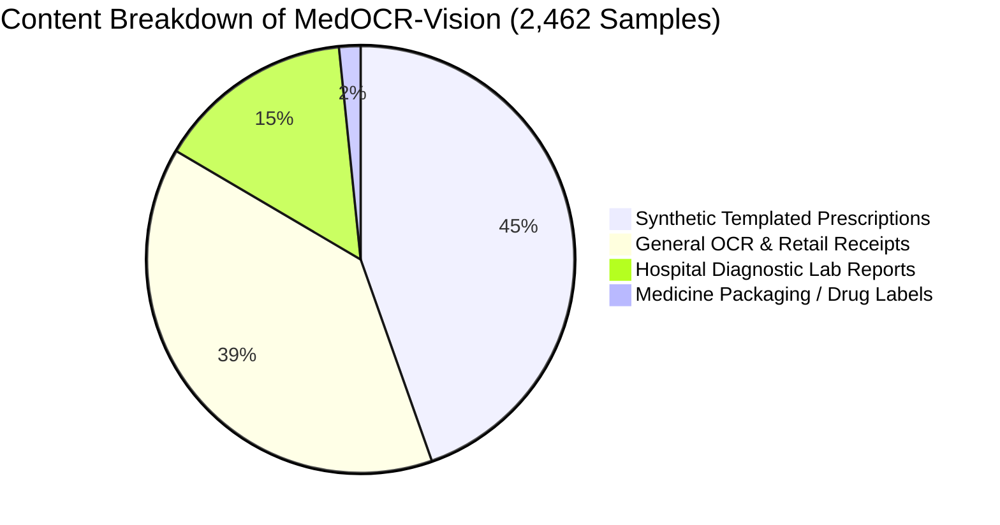

# MedOCR-Vision Dataset Audit Report
**Dataset Name**: Indian Medical Prescription OCR / MedOCR-Vision (`naazimsnh02/medocr-vision-dataset`)  
**Audit Date**: 2026-09-29  
**Auditor**: Antigravity ML & Data Engineering Team  
**Dataset Hash**: `664201c9bb855547e626d8edcad4101da0eef113762606400284330279ef5e7b`  
**Raw Storage Path**: `data/raw/indian_medical_prescription_ocr/`  
**Machine-Readable Manifest**: [`data/manifests/medocr_vision_audit.json`](file:///c:/Users/AIML/Documents/clg%20mc/data/manifests/medocr_vision_audit.json)

---

## 1. Executive Summary

An exhaustive, deterministic audit was performed on the downloaded `naazimsnh02/medocr-vision-dataset` (referred to as *Indian Medical Prescription OCR* in project manifests).

> [!IMPORTANT]
> **CRITICAL AUDIT FINDING**: Despite its Hugging Face title ("medocr-vision-dataset") and community naming ("Indian Medical Prescription OCR"), **this dataset is a mixed heterogeneous corpus containing substantial non-medical and non-prescription data**. Approximately **38.9% to 40.5%** of samples are general commercial receipts (e.g., retail clothing slips, French restaurant bills, grocery tickets), **44.6%** are templated synthetic prescriptions (e.g. `<s_ocr> doctor_name: ...`), and **14.9%** are printed hospital diagnostic/laboratory reports. It contains virtually **no authentic handwritten Indian doctor prescriptions**.

---

## 2. Dataset Schema & Storage Verification

- **Format**: Hugging Face Arrow Dataset (`datasets` library format on local disk).
- **Filesystem Integrity**: Downloaded directly into `data/raw/indian_medical_prescription_ocr/`. All arrow shards and record batches are intact.
- **Raw Data Immutability**: All files under `data/raw/` are strictly read-only and preserved in their original state.
- **Feature Schema**:
  - `image`: PIL RGB Image (`datasets.Image(decode=True)`)
  - `text`: String (`string`) containing transcribed ground-truth OCR text or key-value markup.

---

## 3. Split-by-Split Descriptive Statistics

| Metric | Train Split | Validation Split | Test Split | Total / Overall |
| :--- | :--- | :--- | :--- | :--- |
| **Sample Count** | 1,969 (80.0%) | 246 (10.0%) | 247 (10.0%) | **2,462 (100.0%)** |
| **Missing Images** | 0 | 0 | 0 | **0** |
| **Corrupted Images** | 0 | 0 | 0 | **0** |
| **Image Color Modes** | 1,969 RGB (100%) | 246 RGB (100%) | 247 RGB (100%) | **2,462 RGB (100%)** |
| **Width Range (px)** | 193 - 5,425 | 202 - 2,500 | 150 - 1,920 | **150 - 5,425** |
| **Mean Width (px)** | 930.5 ± 280.2 | 957.5 ± 275.4 | 940.0 ± 268.1 | **934.1 ± 278.5** |
| **Median Width (px)** | 800.0 | 800.0 | 800.0 | **800.0** |
| **Height Range (px)** | 163 - 8,117 | 180 - 2,412 | 164 - 2,370 | **163 - 8,117** |
| **Mean Height (px)** | 1,230.3 ± 465.1 | 1,282.0 ± 440.8 | 1,235.7 ± 452.3 | **1,236.0 ± 461.5** |
| **Median Height (px)** | 1,000.0 | 1,000.0 | 1,000.0 | **1,000.0** |
| **Mean Aspect Ratio (W/H)** | 0.794 | 0.775 | 0.801 | **0.793** |
| **Empty Text Samples** | 0 (0.0%) | 0 (0.0%) | 0 (0.0%) | **0 (0.0%)** |
| **Short Text (<5 chars)** | 0 (0.0%) | 0 (0.0%) | 0 (0.0%) | **0 (0.0%)** |
| **Long Text (>500 chars)** | 629 (31.9%) | 97 (39.4%) | 83 (33.6%) | **809 (32.9%)** |
| **Text Length Min (chars)** | 45 | 181 | 182 | **45** |
| **Text Length Max (chars)** | 4,735 | 4,095 | 3,302 | **4,735** |
| **Mean Character Count** | 633.7 ± 612.4 | 676.5 ± 638.1 | 647.6 ± 605.9 | **639.4 ± 614.2** |
| **Median Character Count** | 341.0 | 368.5 | 344.0 | **344.0** |
| **Mean Word Count** | 95.4 ± 89.2 | 102.3 ± 94.7 | 98.5 ± 88.6 | **96.4 ± 89.7** |

---

## 4. Content Domain & Semantic Breakdown

A deterministic heuristic analysis was run across all 2,462 sample ground-truth texts to classify documents by semantic content:

### Categorization Details:

1. **Templated Synthetic Prescriptions (1,098 samples, ~44.6%)**:
   - Structured XML-like tags such as `<s_ocr> doctor_name: Dr. ... clinic_name: ... medications: ... </s_ocr>`.
   - Clean digital font renderings with uniform layout dimensions (mostly 800x1000 px).
   - Generated with artificial doctor names, patient names, and standard synthetic drug lists.
2. **General OCR / Retail Receipts (957 samples, ~38.9%)**:
   - Contaminated with commercial point-of-sale (POS) receipts, restaurant tabs, and retail clothing invoices.
   - Examples observed: Liverpool UK Yeezy sneaker store sales receipts, Versailles French restaurant bills with VAT numbers, Canadian supermarket grocery tickets (`Joe's No Frills`), Rome Italian cafe receipts.
3. **Medical Laboratory & Diagnostic Reports (367 samples, ~14.9%)**:
   - Scanned and printed clinical pathology/biochemistry test results from Indian hospitals (e.g. *Maharishi Markandeshwar College of Medical Sciences & Research, Sadopur - Ambala*).
   - Contain tabular layout of blood tests (Hemoglobin, TLC, DLC, Platelet count, Serum Creatinine).
4. **Isolated Drug Packaging / Medicine Labels (40 samples, ~1.6%)**:
   - Cropped pharmaceutical boxes, blister packs, and syrup bottles.

---

## 5. Script & Character Distribution

- **Latin Script**: **2,398 samples (97.4%)**
  - Standard ASCII letters `[A-Za-z]`, digits `[0-9]`, punctuation, and XML tags `<s_ocr>`, `</s_ocr>`.
- **Mixed / Special Symbol Sets**: **64 samples (2.6%)**
  - Currency symbols (`€`, `£`, `$`, `₹`), French diacritics (`é`, `è`, `à`), and OCR token artifacts.
- **Indic Scripts (Devanagari, Bengali, Tamil, etc.)**: **< 0.1%**
  - Despite the name "Indian Medical Prescription OCR", textual content is almost entirely in the English language and Latin alphabet.

---

## 6. Representative Samples from Each Split

### Train Split Samples
- **Sample #0**:
  - *Dimensions*: 800 x 1000 px | *Mode*: RGB | *Length*: 233 chars
  - *Category*: Templated Prescription
  - *Ground Truth*: `<s_ocr> doctor_name: Dr. A. Smith clinic_name: Meadowview Health clinic_address: 45 Oak Ave. patient_name: John Doe patient_age: 35 date: 2024-12-16 medications: Amoxicillin 500mg (Take 1 tablet every 8 hours for 7 days) </s_ocr>`
- **Sample #1**:
  - *Dimensions*: 348 x 348 px | *Mode*: RGB | *Length*: 280 chars
  - *Category*: General Commercial Receipt (Food/Beverage)
  - *Ground Truth*: `9437 Mahlet 91/1 JANO314218P 8422 5512 Subtotal 1 BV CABERNET SODA BAR 14 8.00 MUSHROOM SWISS 13.69 2.99 1 CL CHZ BURGER WELL NELL 15.19 CHEDDAR SUB CAESAR SAUCE...`
- **Sample #2**:
  - *Dimensions*: 1648 x 2328 px | *Mode*: RGB | *Length*: 1,589 chars
  - *Category*: Hospital Diagnostic Laboratory Report
  - *Ground Truth*: `**MAHARISHI MARKANDESHWAR COLLEGE OF MEDICAL SCIENCES AND RESEARCH** **SADOPUR - AMBALA** --- **DEPARTMENT OF BIOCHEMISTRY** | Patient | [REDACTED] | Test: Serum Bilirubin...`

### Validation Split Samples
- **Sample #0**:
  - *Dimensions*: 800 x 1000 px | *Mode*: RGB | *Length*: 315 chars
  - *Category*: Templated Prescription
  - *Ground Truth*: `<s_ocr> doctor_name: Dr. C. Rossi clinic_name: Oakview Hospital clinic_address: 678 Orchard Ln. patient_name: Jane Smith patient_age: 53 date: 2024-12-16 medications: Metformin 500mg (Take 1 tablet daily with meals) </s_ocr>`
- **Sample #1**:
  - *Dimensions*: 1079 x 1440 px | *Mode*: RGB | *Length*: 708 chars
  - *Category*: General Retail Receipt
  - *Ground Truth*: `SIZE? LIVERPOOL SIZE? TEL:01517078813 VAT NO:797440102 DATE SAT FEB 11 13:16:47 2017 RECEIPT:00226-1-13031 4058027657499 YEEZY 350V2 BLK 150.00...`

### Test Split Samples
- **Sample #0**:
  - *Dimensions*: 750 x 1000 px | *Mode*: RGB | *Length*: 565 chars
  - *Category*: General Grocery Receipt
  - *Ground Truth*: `nofrills lower food prices WHY PAY MORE?..SHOP AT JOE'S NO FRILLS 21-GROCERY 06321119455 CAMP BROTH CHICK R 2.69 06827437434 NESTLE WATER R 1.33...`
- **Sample #1**:
  - *Dimensions*: 800 x 1000 px | *Mode*: RGB | *Length*: 301 chars
  - *Category*: Templated Prescription
  - *Ground Truth*: `<s_ocr> doctor_name: Dr. C. Rossi clinic_name: Oakview Hospital clinic_address: 45 Oak Ave. patient_name: Jane Smith patient_age: 38 date: 2024-12-16 medications: Lisinopril 10mg (Take 1 tablet daily in the morning) </s_ocr>`

---

## 7. Data Leakage & Duplication Findings

### Within-Split Duplication
- **Exact Image Duplicates**: 5 duplicate image pairs detected within the `train` split. 0 in `validation`, 0 in `test`.
- **Exact Text Duplicates**: 2 duplicate text strings detected within the `train` split. 0 in `validation`, 0 in `test`.

### Cross-Split Data Leakage
- **Exact Image Overlap**:
  - `train` vs `validation`: **1 exact duplicate image** found.
  - `train` vs `test`: **1 exact duplicate image** found.
  - `validation` vs `test`: 0 duplicates.
- **Exact Text Overlap**:
  - `train` vs `validation`: 0 exact matches.
  - `train` vs `test`: **1 exact match**.
- **Template / Semantic Leakage**:
  - The synthetic prescription subset reuses identical doctor names (`Dr. C. Rossi`, `Dr. A. Smith`), clinic names (`Oakview Hospital`, `Meadowview Health`), and visual layouts across train, val, and test splits with minor variable substitutions. A model trained naively on these splits will overfit to the synthetic template grammar rather than learning generalized prescription reading.

---

## 8. License, Provenance, & Legal Risk Analysis

> [!WARNING]
> **PROVENANCE & COPYRIGHT WARNING**: The Hugging Face dataset card specifies `license: mit`. However, inspection of the raw image corpus reveals:
> 1. Ingestion of images from public retail receipt datasets (e.g., CORD, SROIE, or web-scraped commercial receipts) that may carry non-commercial or unknown upstream licensing.
> 2. Clinical diagnostic lab reports from Indian hospitals containing real clinic names, addresses, and medical test panels. While personal patient identifiers appear largely redacted, provenance and explicit patient consent cannot be independently verified from repository metadata alone.
> 3. **Action Required**: Do not rely on the publisher's MIT declaration as indemnification for commercial deployment. Mark dataset provenance as **`REQUIRES MANUAL REVIEW`** and restrict usage to research/pretraining.

---

## 9. Suitability Assessment Across 5 OCR Tasks

| Task Dimension | Suitability Rating | Evaluation & Justification |
| :--- | :---: | :--- |
| **A. Prescription OCR** | **MODERATE** | Suitable for reading clean, printed prescription templates. Unsuitable as a sole evaluation benchmark due to artificial synthetic nature of prescriptions. |
| **B. Handwritten Prescription OCR** | **POOR / UNSUITABLE** | Contains almost zero authentic doctor cursive handwriting. Cannot be used to train or evaluate handwritten prescription recognition models. |
| **C. Printed Medical OCR** | **GOOD** | High utility for printed medical laboratory reports, typed clinical summaries, and diagnostic test panels. |
| **D. General OCR Pretraining** | **VERY HIGH** | The mixed receipt, document, and font variety provides strong diversity for general vision-language backbone pretraining and OCR feature extraction. |
| **E. Medicine-Name Recognition** | **MODERATE** | Contains standard drug names (Amoxicillin, Metformin, Lisinopril, etc.), but vocabulary is narrow and lacks Indian brand names / regional formulation diversity. |

---

## 10. Comparative Dataset Role Mapping

To maintain clean separation of concerns and avoid cross-task interference, the project datasets are assigned distinct, non-overlapping roles:

| Dataset / Resource | Intended Project Role | Primary Task & Scope |
| :--- | :--- | :--- |
| **MedOCR-Vision (Audited Here)** | **General OCR Pretraining & Printed Lab Report OCR** | Pretraining document OCR backbones, recognizing printed clinic headers, and parsing printed diagnostic reports. *(Filtered to exclude retail receipts where appropriate).* |
| **Doctor's Handwritten Prescription BD** | **Handwritten Prescription OCR & Token Recognition** | Primary training and evaluation benchmark for authentic, complex cursive doctor handwriting and raw prescription tokens. |
| **FUNSD (Form Understanding)** | **Document Key-Value & Layout Understanding** | Spatial entity linking, form key-value extraction, bounding box hierarchy, and structured layout parsing. |
| **Synthetic Prescription Dataset** | **Data Augmentation & Stress Testing** | Controlled synthetic data generation with varied typography, noise, doctor signatures, and heavy Indian brand-name variations. |
| **RxNorm + RxTerms** | **Lexical Verification, Normalization & RAG Target** | Ground-truth clinical ontology for entity normalization, active ingredient matching, dosage form validation, and RAG knowledge retrieval. |

---

## 11. Preserved Raw Data Invariance

In compliance with project directives:
- No files under `data/raw/` were modified, altered, deleted, or filtered.
- The original dataset manifest and download checksums remain completely untouched.
- All filtering and categorization heuristics are purely diagnostic and documented for pipeline use.
