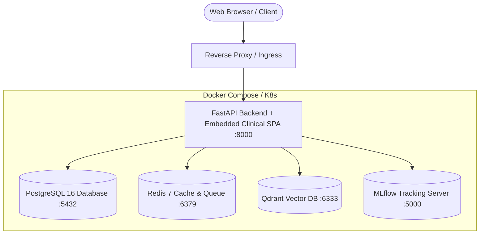

# Phase 8: Containerization, Production Hardening & Deployment Readiness

## 1. System Architecture & Topology

Phase 8 containerizes and hardens the AI Medicine Assistant stack for production deployment across on-premise Kubernetes clusters, Docker Swarm, and cloud infrastructure.



---

## 2. Production Security Hardening & Middlewares

The FastAPI application enforces strict production middleware defenses:

1. **Security Headers (`SecurityHeadersMiddleware`)**:
   - `X-Content-Type-Options: nosniff` — Prevents MIME-type sniffing attacks.
   - `X-Frame-Options: DENY` — Protects against clickjacking.
   - `X-XSS-Protection: 1; mode=block` — Client-side cross-site scripting filter.
   - `Referrer-Policy: strict-origin-when-cross-origin` — Protects referral leakage.
   - `Content-Security-Policy` — Restricts script, style, and font loading to trusted origin domains.
   - `Strict-Transport-Security` (HSTS) — Enforces HTTPS communication in production environments.

2. **Distributed Tracing & Correlation (`CorrelationIdMiddleware`)**:
   - Extracts or generates a unique UUID `X-Correlation-ID` on each request, propagating it across response headers and structured logs.

3. **DoS & Memory Exhaustion Guard (`RequestSizeLimitMiddleware`)**:
   - Rejects uncompressed or raw payloads exceeding 20MB with `413 Payload Too Large`.

4. **Ephemeral Data & Privacy Invariant**:
   - Uploaded prescription images are processed in-memory and are never permanently stored.
   - Zero patient PHI is logged in server output or persisted in local browser storage.

---

## 3. Database Pooling & Fallbacks

- **Async Connection Pool (`database/connection.py`)**:
  - Utilizes SQLAlchemy `async_engine` with `asyncpg` driver for high-concurrency asynchronous PostgreSQL operations.
  - Connection pooling configured with `pool_size=10`, `max_overflow=20`, `pool_timeout=30`, `pool_pre_ping=True`, and connection recycling every 1800 seconds.
  - Development / Test fallback: gracefully falls back to `aiosqlite` for zero-configuration testing.
- **Connectivity Probes**:
  - `check_database_health()` executes automated `SELECT 1` heartbeat probes.

---

## 4. Container Orchestration & Docker Compose

- **`docker/Dockerfile.backend`**: Multi-stage lightweight Python 3.11 slim image containing OCR runtime libraries (`tesseract-ocr`, `libgl1`, `libglib2.0-0`), backend dependencies, model checkpoints, and embedded static frontend assets.
- **`docker/Dockerfile.frontend`**: Multi-stage Node.js 20 Alpine builder for Next.js standalone export.
- **`docker-compose.yml`**: Full multi-container orchestration defining:
  - `api`: FastAPI inference & RAG backend
  - `db`: PostgreSQL 16 database with volume persistence
  - `cache`: Redis 7 in-memory cache
  - `vector-db`: Qdrant vector database
  - `mlflow`: MLflow experiment tracking server
- **`.dockerignore`**: Excludes training datasets, logs, virtual environments, and `.git` caches to guarantee fast and lean image builds.

---

## 5. Deployment Verification

Run the automated deployment verification probe:
```bash
py scripts/verify_deployment.py
```
This executes automated health checks across:
1. Environment configuration validation
2. Database connectivity & session allocation
3. Phase 4 ML Model Registry loading & checkpoint integrity
4. Medical Knowledge Base & Vector Index verification (59+ clinical chunks)
5. Static Frontend SPA asset health

---

## 6. Important Clinical Validation Limitation

> [!IMPORTANT]
> The passing unit and integration test suite establishes software and integration correctness across APIs, OCR pipelines, normalizers, and RAG retrieval.
> It does **NOT** establish:
> - Clinical safety for unsupervised diagnosis or prescribing
> - Large-scale benchmarked retrieval accuracy on arbitrary medical corpora
> - Complete exhaustive coverage of all world pharmaceuticals
> 
> The application is designed strictly as an evidence-grounded educational and decision-support assistant. All prescribing actions require review by a licensed healthcare professional.
