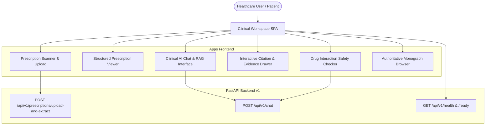

# Phase 7: Modern Web Frontend UI & Interactive Clinical Workspace

## 1. Overview and Architecture

Phase 7 delivers a modern clinical web interface for the AI Medicine Assistant. The frontend architecture interfaces directly with the verified FastAPI backend (Phase 5 Prescription Inference Engine & Phase 6 Knowledge RAG), ensuring that all medical reasoning, OCR parsing, RxNorm concept normalization, drug-drug interaction safety checks, and emergency classifications remain strictly on the backend.

---

## 2. Routes & Endpoints

| Route / URL | Type | Description |
| :--- | :--- | :--- |
| `GET /` | HTML | Main Clinical Intelligence Workspace Single Page Application |
| `GET /app` | HTML | Workspace alias route |
| `GET /static/styles.css` | CSS | Clinical design system & responsive styling |
| `GET /static/app.js` | JS | Interactive controller, tab routing & modal management |
| `GET /static/api.js` | JS | Client-side async API connector |
| `POST /api/v1/prescriptions/upload-and-extract` | API | Ephemeral prescription image OCR & RxNorm verification |
| `POST /api/v1/chat` | API | Grounded clinical Q&A, safety guardrails & drug interaction checks |
| `GET /api/v1/health` & `GET /api/v1/ready` | API | Live system and inference model readiness probes |

---

## 3. Major Components & Functional Workspaces

### A. Prescription Scanner & Upload Zone
- **Drag & Drop**: Native drag/drop and click-to-browse file selector.
- **Client Validation**: Restricts uploads to valid formats (`PNG`, `JPEG`, `WEBP`) up to 15MB.
- **Privacy Notice**: Explains ephemeral in-memory processing with zero persistent image retention.
- **Multi-Stage Progress Bar**: Visually displays pipeline progress:
  1. *Uploading & Validating Image*
  2. *Executing CRNN & Spatial Layout Parsing*
  3. *Extracting Medical Entities & Dosages*
  4. *Performing Multi-Tier RxNorm Normalization*
  5. *Clinical Verification & Confidence Scoring*

### B. Structured Prescription Viewer
- **Overview Metrics**: Displays Doctor name, Patient info, Date, and inference latency.
- **Medicines Table**:
  - Recognized Raw OCR text vs Normalized RxNorm concept.
  - RxCUI tags and pharmacological ingredient.
  - Dosage, strength, frequency, route, and duration.
  - Visual confidence gauge.
  - Verification Status Badges:
    - `✓ VERIFIED` (Green): High-confidence exact/phonetic match.
    - `⚠️ REVIEW REQUIRED` (Amber): Ambiguous or fuzzy match requiring pharmacist review.
    - `✕ UNVERIFIED` (Red/Slate): Unrecognized entity.
- **Action Buttons**: *"Ask AI About This Prescription"* attaches verified context to the chat thread.

### C. Clinical AI Chat & Evidence Workspace
- **Grounded Responses**: Markdown-formatted answers derived strictly from retrieved monographs.
- **Prescription Context Ribbon**: Displays attached medications with verification tags.
- **Entity Badges**: Visual chips for detected clinical entities (`DRUG`, `DOSAGE`, `DISEASE`, `SYMPTOM`).
- **Interactive Citation Pills**: `[Source: chunk_id]` pills that open full provenance modals.
- **Proportionate Safety Disclaimers**: Disclaimers scaled to classified clinical risk level.

### D. Safety Alert Modals & Banners
- **`EMERGENCY`**: Prominent crimson banner with urgent instructions to call emergency services (911 / 112 / 999).
- **`HIGH`**: Amber banner indicating prescribing/diagnosis attempts with mandatory clinical review warning.
- **`OUT_OF_SCOPE`**: Informational banner clarifying medical assistant scope.
- **`MODERATE` / `LOW`**: Standard educational footnotes.

### E. Drug Interaction Safety Checker
- **Interactive Form**: Allows comparing any two medications (e.g. Warfarin + Aspirin).
- **Structured Findings**: Displays Severity (`MAJOR`, `MODERATE`, `CONTRAINDICATED`), Mechanism, Clinical Effect, and Guidance.
- **Clear Unverified Indication**: If an interaction is not present in the verified database, explicitly states that no interaction is documented rather than inventing one.

### F. Evidence & Citation Drawer Modal
- Displays complete provenance: Authority Source, Document Title, Clinical Section, Chunk ID, and verbatim Monograph Excerpt.

---

## 4. Accessibility & Design Standards

- **Semantic HTML5**: Semantic elements (`<header>`, `<nav>`, `<main>`, `<section>`, `<article>`, `<table role="table">`).
- **ARIA Standards**: Comprehensive `role`, `aria-label`, `aria-live="polite"`, `aria-controls`, and `aria-modal="true"`.
- **Contrast & Hierarchy**: Dark slate aesthetic with WCAG AA compliant contrast ratios.
- **Responsive Layout**: Fluid breakpoints supporting desktop ($>1024px$), tablet ($768px - 1024px$), and mobile ($<768px$).
- **Color Independence**: Status information is never conveyed by color alone; text labels and distinct icons accompany all status badges.

---

## 5. Frontend Security & Privacy Controls

- **Zero Client-Side Keys**: No API keys or credentials bundled in client code.
- **Zero Local PHI Storage**: Prescription results and patient details are kept strictly in memory and are never serialized into `localStorage` or `sessionStorage`.
- **XSS Prevention**: All user and backend text is sanitized via `escapeHtml()` before DOM insertion.
- **URL Privacy**: No patient identifiers or prescription texts are passed via URL query parameters.

---

## 6. Testing & Validation

- **Unit Tests (`tests/unit/test_phase7_frontend.py`)**:
  - File existence and asset health.
  - HTML structure, semantic elements, and ARIA roles.
  - CSS tokens, design variables, and responsive media queries.
  - Security audit (zero hardcoded secrets, paths, or keys).
  - Monograph cache integrity.
- **Integration Tests (`tests/integration/test_phase7_frontend_integration.py`)**:
  - `GET /` and `GET /app` route delivery.
  - Static asset serving (`styles.css`, `app.js`, `api.js`).
  - End-to-end user workflow: chat with prescription context.

---

## 7. Known Limitations & Future Enhancements

1. **Client Bundler**: Standalone browser-ready assets are served via FastAPI `StaticFiles`; future production deployment can compile Next.js static export bundles.
2. **Streaming Tokens**: Current LLM responses are delivered atomically; Server-Sent Events (SSE) streaming is planned for Phase 8.
