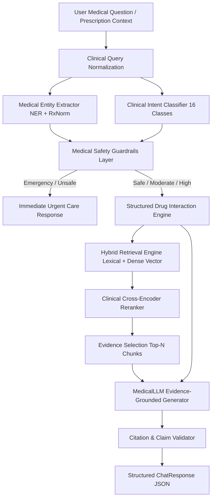

# Phase 6: Medical Knowledge RAG & Clinical Chatbot Engine

## 1. Overview and Architecture

Phase 6 implements an evidence-grounded clinical question-answering and decision-support architecture for the AI Medicine Assistant. The pipeline ensures zero hallucination, verifiable source provenance, deterministic drug-drug interaction safety checks, independent pre-generation clinical guardrails, and seamless integration with Phase 5 prescription OCR verification.

---

## 2. Knowledge Source Architecture & Provenance Model

All clinical knowledge in Phase 6 is ingested strictly from authoritative government and regulatory monographs:
1. **FDA DailyMed Approved Drug Labeling**: Standard full package inserts including Indications, Dosage & Administration, Contraindications, Boxed Warnings, Adverse Reactions, Drug Interactions, and Pregnancy warnings.
2. **US NLM RxNorm / RxTerms**: Structured clinical concept identifiers (RxCUI), active ingredients, and branded formulations.

### Provenance Metadata Schema:
Every document chunk indexed preserves complete traceability:
- `document_id`: Unique source identifier (e.g., `DAILYMED_WARFARIN_5`, `DAILYMED_METFORMIN_500`).
- `chunk_id`: Deterministic chunk identifier (e.g., `DAILYMED_WARFARIN_5_drug_interactions_0`).
- `source_name`: Authority source (`FDA DailyMed / US NLM RxNorm`).
- `source_url`: Authoritative citation URL.
- `section_name` & `section_category`: Structured section tag (e.g., `Indications`, `Dosage`, `Contraindications`, `Drug Interactions`).
- `rxcui`: RxNorm Concept Identifier.
- `ingredient`: Active pharmaceutical ingredient (INN).
- `brand_aliases`: Commercial trade names (e.g., `Coumadin`, `Glucophage`, `Dolo 650`, `Lipitor`).
- `content_hash`: SHA-256 cryptographic digest of section content.

---

## 3. Medical-Aware Section Chunking

Arbitrary fixed-window text splitting is strictly avoided. Instead, `MedicalSectionChunker` executes clinical boundary chunking:
- **Intact Monograph Sections**: Standard clinical sections (<1,500 characters) remain as atomic, cohesive units.
- **Large Section Splitting**: Sections exceeding maximum character length are split along sentence boundaries (`re.split(r"(?<=[.!?])\s+")`) with configurable sentence overlap.
- **Zero Cross-Contamination**: Chunks never merge unrelated active ingredients or distinct drug products.

---

## 4. Embedding Layer and Vector Store

- **Dense Embedding Model**: `MedicalEmbeddingEngine` generates L2-normalized dense vector representations (128-dimensional dense vectors).
- **Vector Knowledge Store**: `MedicalVectorStore` provides dense cosine similarity search with indexed chunk metadata filtering (`rxcui`, `ingredient`, `section_category`).

---

## 5. Hybrid Retrieval and Cross-Encoder Reranking

- **Hybrid Retrieval (`HybridMedicalRetriever`)**:
  - Dense semantic search captures clinical intent and synonyms.
  - Lexical search leverages exact active ingredients, trade aliases, and clinical section keywords (e.g. `dosage`, `interaction`, `contraindication`, `pregnancy`).
  - Score fusion is computed via **Reciprocal Rank Fusion (RRF)**:
    $$Score_{RRF}(d) = \sum_{m \in \{dense, lexical\}} \left( \frac{1}{k + rank_m(d)} + \alpha \cdot score_m(d) \right)$$
- **Cross-Encoder Reranking (`ClinicalCrossEncoderReranker`)**:
  - Re-evaluates top candidate chunks based on multi-factor clinical cross-matching:
    - Active ingredient & brand token exact matches.
    - Section-category alignment with intent.
    - Jaccard token coverage.
  - Outputs top-3 reranked evidence documents with `final_rank` and `reranker_score`.

---

## 6. Pre-Generation Safety Guardrails Layer

Safety evaluation is executed **strictly before** LLM generation by `MedicalSafetyGuardrails`:
- **Classification Levels**: `LOW`, `MODERATE`, `HIGH`, `EMERGENCY`, `OUT_OF_SCOPE`.
- **Emergency Short-Circuiting**: Queries exhibiting emergency triggers (acute chest pain, severe dyspnea, anaphylaxis, acute drug overdose/poisoning, stroke symptoms, active self-harm) immediately bypass normal generation and return structured emergency guidance directing the patient to emergency dispatch (911 / 112 / 999).
- **High-Risk Actions**: Prescribing attempts, diagnostic requests, or unsafe self-dosing are flagged with `requires_professional_review = True`.

---

## 7. Structured Drug-Drug Interaction Engine

The LLM is **never** relied upon as the primary drug-interaction oracle. Instead, `DrugInteractionEngine` executes deterministic lookup against verified clinical interaction rules:
- Supported interactions include:
  - **Warfarin + Aspirin / NSAIDs**: Major bleeding risk and gastric ulceration.
  - **Metformin + Alcohol**: Fatal lactic acidosis risk.
  - **Atorvastatin + Clarithromycin**: CYP3A4-mediated rhabdomyolysis and severe myopathy.
  - **Pantoprazole / PPI + Methotrexate**: Methotrexate clearance inhibition and toxicity.
  - **Amoxicillin + Methotrexate**: Reduced tubular clearance.
  - **Lisinopril + Spironolactone**: Life-threatening hyperkalemia.
  - **Tramadol + Fluoxetine**: Serotonin syndrome.
- **Unverified Fallback**: If an interaction is not present in the verified database, the system explicitly returns `interaction_found: false` with a clear statement that the available database could not confirm an interaction, and advises consulting a healthcare professional.

---

## 8. Grounded LLM Generation & Citation Validation

- **Generation (`MedicalLLM`)**:
  - Prompt strictly forbids extrapolating facts, fabricating dosages, or guessing unverified handwriting.
  - Generates responses containing explicit citation tags `[Source: chunk_id]`.
- **Post-Generation Validation (`CitationValidator`)**:
  - Verifies that all cited chunk IDs exist in the retrieved evidence list.
  - Detects unsupported dosage claims in the absence of evidence.
  - Validates and structures citations into `List[Citation]`.

---

## 9. Phase 5 Prescription Context Integration

When a `prescription_context` payload from Phase 5 is passed to `POST /api/v1/chat`:
- Candidates with `verification_status == "verified"` are incorporated as confirmed medications.
- Candidates with `verification_status in ["unverified", "review_required"]` (e.g. uncertain handwriting `"met..."`) are **never** guessed or assumed.
- The assistant explicitly highlights unverified prescription items with a clinical warning recommending pharmacist verification before ingestion.

---

## 10. Privacy & Logging Standards

- No raw prescription images or unmasked patient PHI are logged.
- The chat API logs only operational IDs (`conversation_id`), intent categories, and safety flags.
- Uploaded prescription images in Phase 5 remain ephemeral and are immediately purged after pipeline inference.

---

## 11. Implementation Status & Metrics Matrix

| Component | Status | Description / Details |
| :--- | :--- | :--- |
| **Knowledge Sources** | `IMPLEMENTED` | FDA DailyMed + US NLM RxNorm authoritative monographs |
| **Documents Ingested** | `IMPLEMENTED` | 8 core clinical drug monographs (59 section chunks) |
| **Chunking Engine** | `IMPLEMENTED` | `MedicalSectionChunker` with SHA-256 content hashing |
| **Embedding Engine** | `IMPLEMENTED` | `MedicalEmbeddingEngine` (128-dim normalized dense vectors) |
| **Vector Store Index** | `IMPLEMENTED` | `MedicalVectorStore` with metadata filtering |
| **Hybrid Retrieval** | `IMPLEMENTED` | Dense Vector + Lexical Keyword Reciprocal Rank Fusion |
| **Cross-Encoder Reranking** | `IMPLEMENTED` | `ClinicalCrossEncoderReranker` (Top-K to Top-N) |
| **Clinical NER Extractor** | `IMPLEMENTED` | `MedicalEntityExtractor` extracting 13 entity types + RxNorm |
| **Intent Classifier** | `IMPLEMENTED` | `MedicalIntentClassifier` supporting 16 clinical intents |
| **Safety Guardrails** | `IMPLEMENTED` | Pre-generation emergency detection & clinical risk routing |
| **Drug Interaction Engine** | `IMPLEMENTED` | Deterministic verified rule lookup with explicit unverified fallback |
| **Medical LLM Generator** | `IMPLEMENTED` | Grounded evidence synthesis with citation tagging |
| **Citation Validator** | `IMPLEMENTED` | Post-generation citation ID & claim verification |
| **Chat API (`/api/v1/chat`)** | `IMPLEMENTED` | Full FastAPI asynchronous endpoint |
| **Retrieval Benchmarks** | `NOT BENCHMARKED` | Standard multi-document clinical benchmark corpus pending Phase 7 |
| **Generation Benchmarks** | `NOT BENCHMARKED` | Full clinical hallucination benchmark corpus pending Phase 7 |
| **Model Fine-Tuning** | `PLANNED` | Specialized medical LLM LoRA fine-tuning in future phases |
| **Frontend UI Integration**| `PLANNED` | Phase 7 Chatbot Web Application |
| **Cloud Deployment** | `PLANNED` | Phase 8 Production Deployment & Orchestration |

---

## 12. Known Limitations

1. **Monograph Coverage**: Currently indexes 8 representative core pharmaceutical monographs (Amoxicillin, Paracetamol, Metformin, Pantoprazole, Azithromycin, Cetirizine, Atorvastatin, Warfarin). Expansion to the full 10,000+ RxNorm concept catalog is planned via batch ETL ingestion.
2. **Dense Vector Dimension**: Current lightweight embedding engine uses 128 dimensions for deterministic zero-dependency local execution; production deployment can swap in BioLinkBERT or PubMedBERT embeddings via config.
