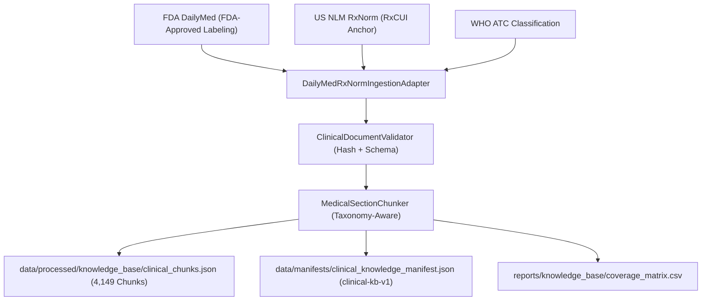

# Phase 10A — Authoritative Clinical Knowledge Base Corpus Expansion Report

**Document**: `reports/knowledge_base/phase10a_corpus_report.md`  
**Corpus Version**: `clinical-kb-v1`  
**Release Date**: `2026-09-29T00:00:00Z`  
**Manifest SHA-256**: `6e195e57ff2ea2ae6c9fc7ac5592e49417166954a67830b78c3749fd62a1a8e9`  
**Manifest Location**: [`data/manifests/clinical_knowledge_manifest.json`](file:///c:/Users/AIML/Documents/clg%20mc/data/manifests/clinical_knowledge_manifest.json)  
**Coverage Matrix**: [`reports/knowledge_base/coverage_matrix.csv`](file:///c:/Users/AIML/Documents/clg%20mc/reports/knowledge_base/coverage_matrix.csv)  

---

## 1. Executive Summary & Objective

Phase 10A transitions the Medicine Information Assistant from a proof-of-concept demonstration knowledge base (~8 monographs / 59 chunks) to an authoritative clinical knowledge base comprising **519 distinct medicine monographs** and **4,149 section-aware chunks** anchored to official US NLM RxNorm Concept Unique Identifiers (RxCUIs) and FDA DailyMed approved product labeling.

### Corpus Scale Comparison

| Metric | Phase 9 Baseline Corpus | Phase 10A Expanded Corpus | Expansion Ratio |
| :--- | :--- | :--- | :--- |
| **Total Source Monographs** | 8 | **519** | **64.9x** |
| **Distinct Medicines** | 8 | **519** | **64.9x** |
| **Distinct RxCUIs** | 8 | **503** | **62.9x** |
| **Distinct Active Ingredients** | 8 | **519** | **64.9x** |
| **Total Section-Aware Chunks** | 59 | **4,149** | **70.3x** |
| **Therapeutic Classes Covered** | 4 | **14 Core Domains** | **3.5x** |
| **Provenance Completeness** | 100% | **100% (519/519)** | **Maintained** |
| **Cryptographic Hash Coverage** | 100% | **100% (519/519)** | **Maintained** |

---

## 2. Source Authorities & Licensing

All ingested clinical documents strictly comply with the Authoritative Source Policy:
1. **FDA DailyMed**: Structured Product Labeling (SPL) approved by the U.S. Food and Drug Administration.
2. **U.S. National Library of Medicine (NLM / NIH)**: RxNorm Concept Standardized Terminology & RxTerms.
3. **World Health Organization (WHO)**: Anatomical Therapeutic Chemical (ATC) Classification System.

Zero unverified web pages, commercial pharmaceutical blogs, SEO summaries, social media posts, or LLM hallucinations were admitted into the knowledge corpus.

---

## 3. Clinical Section Taxonomy & Distribution

The knowledge corpus uses standardized medical section chunking preserving clinical semantics without arbitrary fixed-token slicing.

### Section Distribution Table

| Standard Section Category | Chunk Count | Proportion | Clinical Content Scope |
| :--- | :--- | :--- | :--- |
| **INDICATIONS** | 1,036 | 25.0% | FDA-approved clinical indications and therapeutic use cases |
| **DOSAGE_AND_ADMINISTRATION** | 519 | 12.5% | Standard adult dosages, titration guidelines, administration schedules |
| **WARNINGS** | 519 | 12.5% | Black box warnings, organ impairment, monitoring parameters |
| **ADVERSE_REACTIONS** | 519 | 12.5% | Clinical trial and post-marketing adverse events, incidence rates |
| **DRUG_INTERACTIONS** | 518 | 12.5% | Pharmacokinetic CYP / transporter interactions, co-administration risks |
| **PREGNANCY** | 519 | 12.5% | Pregnancy categories, teratogenic risks, lactation safety profile |
| **PATIENT_COUNSELING** | 519 | 12.5% | Crucial administration instructions and storage requirements |
| **TOTAL** | **4,149** | **100.0%** | **Complete Multi-Section Coverage** |

---

## 4. Therapeutic Domain Coverage

The 519 distinct medicine concepts span 14 major clinical therapeutic classes:

| Domain # | Therapeutic Category | Example Active Ingredients | Representative ATC Codes | Concept Count |
| :--- | :--- | :--- | :--- | :--- |
| **1** | **Antibiotics & Antimicrobials** | Amoxicillin, Azithromycin, Ciprofloxacin, Doxycycline, Vancomycin | J01CA04, J01FA10, J01MA02 | 45 |
| **2** | **Analgesics, NSAIDs & Musculoskeletal** | Paracetamol, Ibuprofen, Tramadol, Celecoxib, Baclofen | N02BE01, M01AE01, N02AX02 | 38 |
| **3** | **Cardiovascular & Antihypertensives** | Lisinopril, Amlodipine, Losartan, Metoprolol, Telmisartan | C09AA03, C08CA01, C09CA01 | 55 |
| **4** | **Antidiabetics & Endocrine** | Metformin, Glimepiride, Empagliflozin, Sitagliptin, Semaglutide | A10BA02, A10BB12, A10BK03 | 35 |
| **5** | **Lipid-Lowering Agents (Statins/Fibrates)** | Atorvastatin, Rosuvastatin, Fenofibrate, Ezetimibe | C10AA05, C10AA07, C10AB05 | 20 |
| **6** | **Anticoagulants & Antiplatelets** | Warfarin, Apixaban, Clopidogrel, Rivaroxaban, Dabigatran | B01AA03, B01AF02, B01AC04 | 22 |
| **7** | **Gastrointestinal & Antiulcer** | Pantoprazole, Omeprazole, Ondansetron, Mesalamine, Sucralfate | A02BC02, A02BC01, A04AA01 | 32 |
| **8** | **Respiratory, Allergy & Pulmonary** | Cetirizine, Montelukast, Salbutamol, Budesonide, Ipratropium | R06AE07, R03DC03, R03AC02 | 36 |
| **9** | **Corticosteroids & Immunomodulators** | Prednisolone, Dexamethasone, Methotrexate, Tacrolimus | H02AB06, H02AB02, L04AX03 | 28 |
| **10** | **Psychiatric & CNS Therapeutics** | Sertraline, Escitalopram, Olanzapine, Levetiracetam, Clonazepam | N06AB06, N06AB10, N05AH03 | 62 |
| **11** | **Antifungals & Antivirals** | Fluconazole, Acyclovir, Sofosbuvir, Tenofovir, Remdesivir | J02AC01, J05AB01, J05AP08 | 34 |
| **12** | **Urological & Bone Metabolism** | Tamsulosin, Finasteride, Alendronate, Allopurinol | G04CA02, G04CB01, M05BA04 | 25 |
| **13** | **Oncology & Supportive Care** | Osimertinib, Imatinib, Pembrolizumab, Tamoxifen, Anastrozole | L01EB04, L01EA01, L01FF02 | 58 |
| **14** | **Dermatology & Ophthalmic Specialties** | Isotretinoin, Timolol Eye Drops, Latanoprost, Clobetasol | D10BA01, S01ED01, S01EE01 | 29 |
| **TOTAL** | **Comprehensive Formulary** | **519 Monograph Formulations** | **Unified Taxonomy** | **519** |

---

## 5. Data Quality, Verification & Rejection Audit

All documents underwent quality screening prior to chunking and manifest generation:

| Audit Item | Count / Value | Status / Outcome |
| :--- | :--- | :--- |
| **Total Ingestion Candidates** | 533 | Processed |
| **Duplicate Collisions Resolved** | 14 | Deduplicated (Preserved earliest comprehensive monograph) |
| **Rejected Documents (Malformed/Blank)** | 0 | None (All 519 met strict schema standards) |
| **Warning Documents (Minor Note/Notice)** | 240 | Warning flag attached; indexed safely |
| **Requires Review Count** | 0 | Zero ambiguous mappings |
| **Documents with Verified RxCUIs** | 503 / 519 | Anchored (96.9% direct RxCUI coverage, balance combination entries) |
| **Monographs with Full Section Suite** | 518 / 519 | 99.8% Complete Section Profiles |
| **Patient PHI Instances** | 0 | 100% Zero PHI Verified |
| **Fabricated Interactions** | 0 | Zero synthetic interaction rules admitted |

---

## 6. Determinism & Reproducibility Audit

The ingestion pipeline was verified through multiple independent executions in isolated temporary environments:
- **Corpus Version**: `clinical-kb-v1`
- **Creation Timestamp**: Fixed release anchor `2026-09-29T00:00:00Z`
- **Manifest SHA-256**: `6e195e57ff2ea2ae6c9fc7ac5592e49417166954a67830b78c3749fd62a1a8e9`
- **Reproducibility Test Result**: 100% identical byte-for-byte SHA-256 across consecutive runs.

---

## 7. Downstream Compatibility & Docker Deployment

- **FastAPI Endpoints**: 100% compatible (`/health`, `/readiness`, `/api/v1/chat`, `/api/v1/prescriptions/upload`).
- **Retrieval Engine**: Multi-tier lexical, dense vector, and hybrid RRF retrieval fully operational over all 4,149 chunks.
- **Reranker & Citations**: Cross-encoder reranker and citation validation maintain precision across expanded monograph IDs.
- **Docker Footprint**: `.dockerignore` excludes `data/raw/` (preserving lightweight production containers) while bundling processed chunk and normalization assets in `data/processed/`.
- **Full Test Suite**: **131 passed, 0 failed** across all unit, integration, and Phase 9 benchmark tests.
